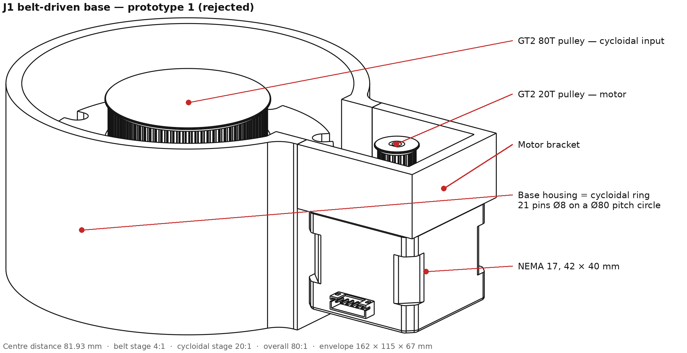
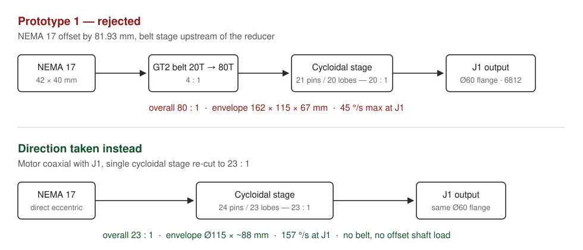

# 0001 — Belt-driven J1 base (prototype 1)

**Status:** rejected
**Date:** 2026-08-26
**Joint:** J1 (base yaw)
**CAD:** [`cad/rejected/j1-belt-base-v1/PrototipoBase1.step`](../../cad/rejected/j1-belt-base-v1/PrototipoBase1.step)

---

## Summary

The first base prototype drove J1 with a **GT2 belt stage (20T → 80T, 4:1) upstream of a
21-pin cycloidal stage (20:1)**, for an overall ratio of **80:1**. The motor sat beside the
axis, 81.93 mm away, so that its 40 mm body did not stack under the reducer.

It is rejected for three reasons:

1. The belt is the only element in the drive whose properties **drift with time,
   temperature and tension**, and it is the only one that can fail by **skipping teeth** —
   an unrecoverable position loss in an open-loop stepper joint.
2. Belt tension puts a **permanent ~95–125 N radial preload** on the shaft that carries the
   cycloidal eccentric, through 3D-printed bearing seats. That is the one shaft in the joint
   where radial deflection changes the gear mesh itself.
3. The height it buys back is **~21 mm (≈24 %)**, paid for with a **162 × 115 mm footprint
   instead of Ø115 mm**, two pulleys, a belt, a longer input shaft and its bearings — and
   with a J1 module that no longer looks like every other joint in the arm.

On top of that, the ratio was wrong: **80:1 over-reduces J1**. My sizing calculation puts
the requirement at **23:1**, which a single cycloidal stage delivers on its own, with the
motor coaxial and no belt at all.





---

## What was built

Measured from the CAD assembly (`PrototipoBase1.step`):

| Item | Value |
|---|---|
| Motor | NEMA 17, 42 × 42 × 40 mm |
| Belt stage | GT2, 20T → 80T pulleys, ~11 mm tooth face |
| Pitch diameters | 12.73 mm / 50.93 mm |
| Centre distance | 81.93 mm (fixed — no tensioner or adjustment slot modelled) |
| Required belt length | 268.3 mm ≈ 134 teeth |
| Cycloidal stage | 21 ring pins Ø8 on a Ø80 pitch circle → 20-lobe disc → 20:1 |
| Main bearing | 6812, 60 × 78 × 10 mm |
| Output | Ø60 flange, 8 mm shaft interface |
| Overall ratio | 4 × 20 = **80:1** |
| Envelope | 161.9 × 115.0 × 67.0 mm (motor included) |
| Base body | Ø115 cylinder + 45 mm motor bracket |

Layout: the motor hangs shaft-down at X = −81.93 mm, its 20T pulley at the bottom of the
base; the 80T pulley sits on the cycloidal input shaft on the J1 axis; the cycloidal ring
is cut directly into the base housing; the 6812 bearing carries the output flange at the top.

---

## Why it was rejected

<details>
<summary><b>1. The belt adds lost motion and drift where it is hardest to observe</b></summary>

Two things are worth separating here, because they do not behave the same way.

**Lost motion is attenuated — but it is still new.** The belt sits *upstream* of the
cycloidal stage, so tooth-to-groove clearance at the pulleys is divided by 20 before it
reaches J1. Roughly 0.05–0.1 mm of belt travel is 0.45–0.9° at the motor pulley
(pitch radius 6.37 mm) and therefore only **0.02–0.05° at the output**. Belt compliance is
attenuated even harder: referred to the output, the belt's torsional stiffness is multiplied
by i² = 400, so it is not the dominant compliance in the chain either.

So the honest version of the backlash argument is not "the belt dominates the error budget".
It is this:

- Both pulleys are printed. A printed 80T GT2 pulley carries real pitch error and runout,
  and that injects a **once-per-input-revolution transmission error** which the cycloidal
  stage passes through, phase-locked to the input shaft. Unlike clearance, this does not
  average out.
- The magnitude is **not constant**. Belt tension falls as the printed bracket and pulley
  hubs creep, and it moves with temperature. The joint's error budget therefore has a term
  that changes over weeks of operation with no way to measure it.
- **Nothing observes it.** With the encoder (or step count) on the motor, everything
  downstream of the motor shaft is open-loop. The belt is the one element in that chain that
  can fail *discontinuously* — a skipped tooth is a permanent, silent 18° error at the motor
  and 0.9° at J1, and it does not come back on the next move.

Being paid for in a 3D-printed joint whose whole point is to be repeatable, that is a bad
term to add for 21 mm.
</details>

<details>
<summary><b>2. Belt tension loads the one shaft that must not deflect</b></summary>

With a NEMA 17 at 0.40 N·m and a 20T pulley (pitch radius 6.37 mm), peak tangential force is
**≈ 63 N**. Timing belts are installed at roughly 1.0–1.5 × the peak tangential force, and
the two spans add on the shaft, so both pulley shafts see a **standing radial load in the
order of 95–125 N** — present whether or not the joint is moving.

On the motor side that is merely a shortened bearing life. On the driven side it is worse,
because that shaft **carries the cycloidal eccentric**. The cycloidal mesh is defined by the
eccentricity e; any radial deflection at the eccentric is added directly to e and changes
which lobes are in contact and how deeply. The steel shaft itself barely moves
(≈ 0.01 mm for a Ø8 shaft over a 20 mm overhang), but it is held in **printed bearing
seats**, and PLA/PETG is 60–80× more compliant than steel and creeps under a *sustained*
load. A radial preload that never goes away is exactly the load case printed plastic is
worst at.

The bearing consequence is quantitative: rolling-element life goes as L₁₀ ∝ (C/P)³, so
roughly doubling the radial load on the input bearings costs about **8× of their life**, for
a load that exists only to hold a belt tight.

A coaxial motor removes this load entirely — the input bearings then carry only the mesh
reaction they were sized for.
</details>

<details>
<summary><b>3. The height saving does not pay for the footprint</b></summary>

Measured, not estimated:

| | Belt version (built) | Coaxial NEMA 17 (estimate) |
|---|---|---|
| Height, base plate to output face | **67 mm** | ~88 mm |
| Footprint | **162 × 115 mm** | Ø115 mm |
| Extra parts | 2 pulleys, belt, input shaft + 2 bearings | — |

So the belt buys **≈ 21 mm, about 24 % of the height** — and it buys it in the worst place.
The height it removes is *below* the J1 flange, i.e. pedestal height, which can simply be
recessed into whatever the arm is bolted to, or absorbed into a column that has to exist
anyway. What it adds instead, +47 mm in one horizontal direction, sits at the level where
J1's own link sweeps and where the arm's mounting pattern is defined. Trading axisymmetry
for pedestal height on a base is the wrong direction.

There is also the practical detail that the centre distance is fixed at 81.93 mm with no
tensioner in the model, which pins the belt at 268.3 mm / 134 teeth — not a stock length in
most GT2 closed-loop ranges, and no way to re-tension it after the printed parts creep.
</details>

<details>
<summary><b>4. It breaks the modularity rule the project is built on</b></summary>

The project guideline is a **fully modular arm whose joints are all cycloidal drives on
NEMA 17 motors**. A belt makes J1 the one joint with a different power path, a different
bracket, a different failure mode, a different assembly procedure and a spare part
(the belt) that no other joint needs. For a base that is not weight-critical and not
height-critical, that is a lot of exception to carry.
</details>

---

## The ratio: why 23:1 is enough for J1

J1 is a **vertical axis**, so gravity produces no torque about it. Unlike J2/J3, its ratio is
not set by a static holding load — it is bounded **below by acceleration torque** and
**above by the output speed** the motor can still deliver.

**Assumptions** (replace with your own measured values before quoting these numbers):

| Symbol | Value | Note |
|---|---|---|
| T_hold | 0.40 N·m | NEMA 17 holding torque |
| T_m | 0.24 N·m | usable continuous = 0.6 × holding |
| J_rotor | 5.4 × 10⁻⁶ kg·m² | 54 g·cm² |
| η | 0.75 | printed cycloidal stage, conservative |
| J_L | 0.125 kg·m² | 2.0 kg arm, k = 0.15 m + 0.5 kg payload at 0.40 m |
| ω_target | 90 °/s | J1 slew speed |
| t_ramp | 0.30 s | → α = 5.24 rad/s² |
| n_motor | 600 rpm | useful speed before torque roll-off at 24 V |

**Torque floor**

```
T_acc = J_L · α        = 0.125 × 5.24   = 0.65 N·m
T_req = T_acc + T_fric = 0.65 + 0.50    = 1.15 N·m
i_min = T_req / (T_m · η) = 1.15 / (0.24 × 0.75) ≈ 6.4
```

**Speed ceiling**

```
n_out,req = 90 °/s = 15 rpm
i_max = n_motor / n_out,req = 600 / 15 = 40
```

The feasible band is therefore roughly **6.4 ≤ i ≤ 40**, and 23:1 sits comfortably inside it:

| Ratio | Output torque | Safety factor | Max J1 speed | Reflected inertia / rotor | Resolution (full step) |
|---|---|---|---|---|---|
| 20:1 | 3.60 N·m | 3.1 | 180 °/s | 58 | 0.090° |
| **23:1** | **4.14 N·m** | **3.6** | **157 °/s** | **44** | **0.078°** |
| 80:1 (built) | 14.40 N·m | 12.5 | **45 °/s** | 3.6 | 0.023° |

80:1 gives J1 more than 12× the torque it needs and, in exchange, **half the required slew
speed**. Nothing on this arm needs 14 N·m about a vertical axis.

**The honest caveat.** The one column where 80:1 wins is inertia matching: a reflected
inertia of 44× the rotor is high, and a stepper at that ratio will feel the load during
aggressive ramps. That is the real cost of going to 23:1, and it is accepted deliberately —
the mitigations are keeping J_L down (which the arm design controls anyway), using
trapezoidal/S-curve profiles rather than step jumps, and closing the loop on J1 later if the
open-loop behaviour proves marginal. It is a tuning problem; a belt is a mechanical one.

### What 23:1 means for the cycloidal stage

A single-disc cycloidal drive with N ring pins and an (N−1)-lobe disc, ring fixed, gives
i = N − 1. So:

| Pins on Ø80 | Ratio | Pin spacing | Web between Ø8 pins |
|---|---|---|---|
| 21 (built) | 20:1 | 11.97 mm | 3.97 mm |
| 24 | 23:1 | 10.47 mm | 2.47 mm — too thin |
| 24, pins to Ø6 | 23:1 | 10.47 mm | 4.47 mm ✔ |

**23:1 fits in the existing Ø80 pin circle and the existing Ø115 housing**, provided the pins
go from Ø8 to Ø6. No belt, no offset, no second stage.

---

## Decision

- Drop the belt stage from J1.
- Mount the NEMA 17 coaxially under the cycloidal drive.
- Re-cut the cycloidal stage to **24 pins / 23 lobes = 23:1**, pins Ø6, same Ø80 pitch circle.
- Keep the 6812 output bearing, the Ø60 output flange and the Ø115 housing diameter — the
  parts of prototype 1 that were right.

## What to carry forward

- The housing-as-ring-gear idea (cycloidal pins cut straight into the base) works and saves
  a part; keep it.
- The 6812 (60 × 78 × 10) as the J1 output bearing is well sized for the overhung moment and
  should become the standard bearing for the large joints.
- Ø8 shafting and the Ø60 output flange become the module interface for J1/J2.

## Open questions

- [ ] Verify J_L on the real arm once links 1–3 exist; the 23:1 choice rests on it.
- [ ] Measure the actual efficiency of the printed cycloidal stage — η = 0.75 is a guess.
- [ ] Check that Ø6 pins survive the 4.14 N·m output torque at 24 pins.
- [ ] Decide whether J1 gets an output-side encoder before committing to open-loop 23:1.
